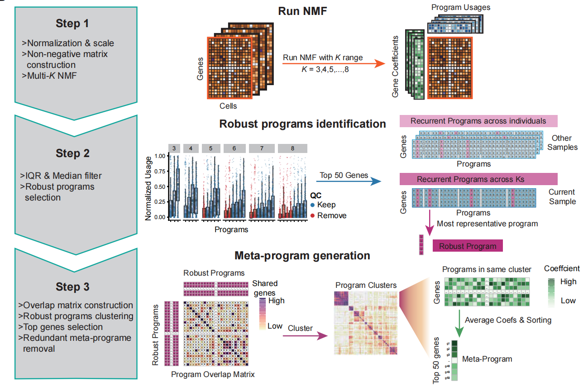

# **sciNMF: Single-Cell Integration by  Non-Negative Matrix Factorization**

sciNMF is an R package designed for exploring the heterogeneity of cellular transcriptional states across individuals using single-cell RNA-seq data. This package is developed by HuangLab at the School of Life Sciences, Xiamen University, Xiamen, Fujian, China.

## **Overview**


We have modified the method from [Gavish A, et al. (Nature, 2023)](https://doi.org/10.1038/s41586-023-06130-4) to identify cellular transcriptional states using NMF on scRNA-seq data.  
There are 3 main steps to identify cell states from scRNA-seq data:  

**Step 1:** Perform multiple ranks Non-Negative Matrix Factorization (NMF) on single-cell gene expression matrices for each individual.

**Step 2:** Filter out low-quality programs by considering their Interquartile Range (IQR) and median usages. Identify robust programs based on their intra- and inter-sample reproducibility.

**Step 3:** Cluster the robust programs based on their overlapping gene numbers. Generate meta-programs from the clustering results, utilizing the top genes with the highest average weight to represent these meta-programs.

## **Dependency packages installation with conda**

We recommend installing the main dependency packages with conda first to avoid version conflicts and installation failures. Please run the following commands in the terminal:

```bash
conda create -n sciNMF r-base -y
conda acivate sciNMF
conda install r-seurat bioconductor-clusterprofiler bioconductor-gsva -y
conda install bioconda::bioconductor-glmgampoi –y # for Seurat::SCTransform acceleration
```

## **Installation**

To install the sciNMF package, you can run the following commands in R:

```R
# Install devtools if not already installed 
if(!requireNamespace("devtools", quietly = TRUE)){
    install.packages("devtools") 
} 
devtools::install_github('Tang-RH/sciNMF')
```

Alternatively, you can download the [release package](https://github.com/Tang-RH/sciNMF/releases/download/0.1.2/sciNMF_0.1.2.tar.gz) and perform a local installation runing the following command in R:

```R
devtools::install_local('the/path/to/package/sciNMF_0.1.2.tar.gz',repos = NULL, type = "source")
```

If there are too many version conflicts among dependent packages, causing the installation failure, we recommend manually installing the following three main dependent packages: `Seurat`, `clusterProfiler`, `GSVA`

## **Test the package**

To check if the package has been installed successfully, you can run the following commands in R:

```R
library(sciNMF)
data("SrtObj")
ls_Demo_WH <- RunNMF(SrtObj, group.by = 'Sample')
```

## **Tutorial**

For detailed instructions and examples, please refer to our comprehensive tutorial.[https://github.com/Tang-RH/sciNMF/tree/master/Tutorial](https://github.com/Tang-RH/sciNMF/tree/master/Tutorial)  
You can directly download our GitHub repository and run the tutorial Jupyter notebook. Run the following commands in the terminal:

```bash
git clone https://github.com/Tang-RH/sciNMF.git
cd sciNMF
```

## **Contact**

Please feel free to open an issue if you encounter any problems while using our package.

## **Citation**

If you find sciNMF useful for your research, please consider citing our publication: Zhang Z, Tang R, Zhu M, et al. [Deciphering cell states and the cellular ecosystem to improve risk stratification in acute myeloid leukemia](https://doi.org/10.1093/bib/bbaf028). Brief Bioinform. 2024
